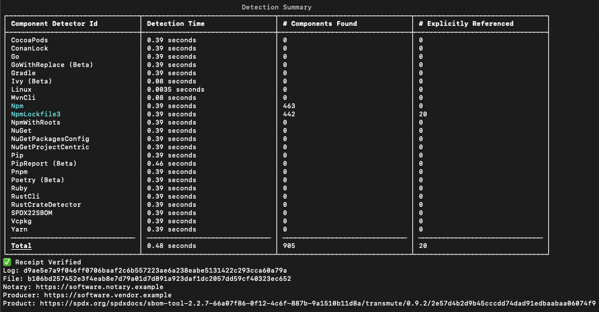

# <a href="https://transmute.industries">Transmute</a>

[](https://github.com/transmute-industries/transmute/actions/workflows/ci.yml)
[](https://npmjs.org/package/@transmute/cli)

#### [Questions?](https://transmute.typeform.com/to/RshfIw?typeform-source=cli)

## Usage

### GitHub Action

```yaml
name: CI
on: [push]
jobs:
  scitt:
    runs-on: ubuntu-latest
    steps:
      - name: Issue Statement
        id: issue_statement
        uses: transmute-industries/transmute@main
        with:
          transmute: |
            scitt issue-statement ./tests/fixtures/private.sig.key.cbor \
            ./tests/fixtures/message.json \
            --output ./tests/fixtures/message.hash-envelope.cbor
      - name: Verify Statement Hash
        id: verify_message
        uses: transmute-industries/transmute@main
        with:
          transmute: |
            scitt verify-statement-hash ./tests/fixtures/public.sig.key.cbor \
            ./tests/fixtures/message.hash-envelope.cbor \
            3073d614f853aaec9a1146872c7bab75495ee678c8864ed3562f8787555c1e22
      - name: Issue Receipt
        id: issue_receipt
        uses: transmute-industries/transmute@main
        with:
          transmute: |
            scitt issue-receipt ./tests/fixtures/private.notary.key.cbor \
            ./tests/fixtures/message.hash-envelope.cbor \
            --log ./tests/fixtures/trans.json
      - name: Verify Receipt Hash
        id: verify_receipt
        uses: transmute-industries/transmute@main
        with:
          transmute: |
            scitt verify-receipt-hash ./tests/fixtures/public.notary.key.cbor \
            ./tests/fixtures/message.hash-envelope-with-receipt.cbor \
            3073d614f853aaec9a1146872c7bab75495ee678c8864ed3562f8787555c1e22
```

See [CI](./.github/workflows/ci.yml) for more examples.

### Nodejs CLI

Install as global binary:

```sh
npm i -g @transmute/cli@latest
```

#### Getting Started

```sh

echo '"@context":
  - https://www.w3.org/ns/credentials/v2
  - https://www.w3.org/ns/credentials/examples/v2
type:
  - VerifiableCredential
  - MyPrototypeCredential
credentialSubject:
  !sd mySubjectProperty: mySubjectValue
' > ./tests/fixtures/issuer-disclosable-claims.yaml

echo '"@context":
  - https://www.w3.org/ns/credentials/v2
  - https://www.w3.org/ns/credentials/examples/v2
type:
  - VerifiableCredential
  - MyPrototypeCredential
credentialSubject:
  mySubjectProperty: mySubjectValue
' > ./tests/fixtures/holder-disclosed-claims.yaml

transmute jose keygen --alg ES256 \
--output ./tests/fixtures/private.sig.jwk.json

transmute vcwg issue-credential ./tests/fixtures/private.sig.jwk.json \
 ./tests/fixtures/issuer-disclosable-claims.yaml \
--credential-type application/vc-ld+sd-jwt \
--output ./tests/fixtures/issuer-disclosable-claims.sd-jwt
```

See [scripts](./scripts/) for more examples.


TODO: all command examples

## Use Cases

### Software Supply Chain

#### In Search of Transparency

##### Product Integrity

```bash

sbom-tool generate -b ./dist -bc ./ -pn transmute -ps transmute.industries \
-pv `jq -r .version package.json` -nsu `git rev-parse --verify HEAD`

transmute scitt issue-statement ./tests/fixtures/private.notary.key.cbor \
./dist/_manifest/spdx_2.2/manifest.spdx.json \
--iss https://software.vendor.example \
--sub `jq -r .documentNamespace ./dist/_manifest/spdx_2.2/manifest.spdx.json` \
--content-type application/spdx+json \
--location https://github.com/.../dist/_manifest/spdx_2.2/manifest.spdx.json \
--output ./dist/_manifest/spdx_2.2/manifest.spdx.scitt.cbor

transmute scitt issue-receipt ./tests/fixtures/private.notary.key.cbor \
./dist/_manifest/spdx_2.2/manifest.spdx.scitt.cbor \
--iss https://software.notary.example \
--sub `jq -r .documentNamespace ./dist/_manifest/spdx_2.2/manifest.spdx.json` \
--log ./tests/fixtures/trans.json \
--output ./dist/_manifest/spdx_2.2/manifest.spdx.scitt.cbor

transmute scitt verify-receipt-hash ./tests/fixtures/public.notary.key.cbor \
./dist/_manifest/spdx_2.2/manifest.spdx.scitt.cbor \
`cat ./dist/_manifest/spdx_2.2/manifest.spdx.json.sha256`

```



##### Compliance Automation

```yaml
name: CI
on: [push]
jobs:
  scitt:
    runs-on: ubuntu-latest
    steps:
      - uses: actions/checkout@v4
      - name: Push Transparency
        uses: transmute-industries/transmute@main
        with:
          neo4j-uri: ${{ secrets.NEO4J_URI }}
          neo4j-user: ${{ secrets.NEO4J_USERNAME }}
          neo4j-password: ${{ secrets.NEO4J_PASSWORD }}
          transmute: |
            graph assist ./dist/_manifest/spdx_2.2/manifest.spdx.scitt.cbor \
              --credential-type application/cose \
              --graph-type application/gql \
              --push
```


<!--
MATCH (statement {
    subject: 'https://spdx.org/spdxdocs/sbom-tool-2.2.7-66a07f86-0f12-4c6f-887b-9a1510b11d8a/transmute/0.9.2/2e57d4b2d9b45cccdd74dad91edbaabaa06074f9'
})
MATCH (receipt {
    subject: statement.subject
})
RETURN statement, receipt
-->
