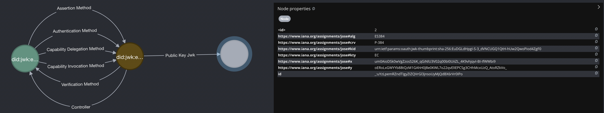

# CBOR Object Signing and Encryption (cose)

```bash
npm i -g @transmute/cli
```

### Diagnostic 

<!--

npm run transmute -- cose diagnostic diagnose \
--input  examples/cose/inclusion-proof.cose \
--output examples/cose/diagnostic.md
-->

```sh
transmute cose diagnostic diagnose \
--input  examples/cose/inclusion-proof.cose \
--output examples/cose/diagnostic.md
```


## Create Private Signing Key

```sh
transmute key generate \
--alg ES384 \
--output examples/cose/private.signing.jwk.json
```


## Export Public Verification Key

```sh
transmute key export \
--input  examples/cose/private.signing.jwk.json \
--output examples/cose/public.verifying.jwk.json
```

<!--

npm run transmute -- graph \
--env '.env' \
--input  'examples/cose/public.verifying.jwk.json'

-->



## Detached

<!-- 
```sh
npm run build;

npm run transmute -- cose key sign \
--issuer-key examples/cose/private.signing.jwk.json \
--input  examples/cose/bafybeigdyrzt5sfp7udm7hu76uh7y26nf3efuylqabf3oclgtqy55fbzdi.jpg \
--output examples/cose/bafybeigdyrzt5sfp7udm7hu76uh7y26nf3efuylqabf3oclgtqy55fbzdi.cose

npm run transmute -- cose key verify \
--input  examples/cose/bafybeigdyrzt5sfp7udm7hu76uh7y26nf3efuylqabf3oclgtqy55fbzdi.jpg \
--signature examples/cose/bafybeigdyrzt5sfp7udm7hu76uh7y26nf3efuylqabf3oclgtqy55fbzdi.cose \
--output examples/cose/bafybeigdyrzt5sfp7udm7hu76uh7y26nf3efuylqabf3oclgtqy55fbzdi.verified.json

```
-->

### Sign 


```sh
transmute cose key sign \
--issuer-key examples/cose/private.signing.jwk.json \
--input  examples/cose/bafybeigdyrzt5sfp7udm7hu76uh7y26nf3efuylqabf3oclgtqy55fbzdi.jpg \
--output examples/cose/bafybeigdyrzt5sfp7udm7hu76uh7y26nf3efuylqabf3oclgtqy55fbzdi.cose
```

### Verify

```sh
transmute cose key verify \
--input  examples/cose/bafybeigdyrzt5sfp7udm7hu76uh7y26nf3efuylqabf3oclgtqy55fbzdi.jpg \
--signature examples/cose/bafybeigdyrzt5sfp7udm7hu76uh7y26nf3efuylqabf3oclgtqy55fbzdi.cose \
--output examples/cose/bafybeigdyrzt5sfp7udm7hu76uh7y26nf3efuylqabf3oclgtqy55fbzdi.verified.json
```

