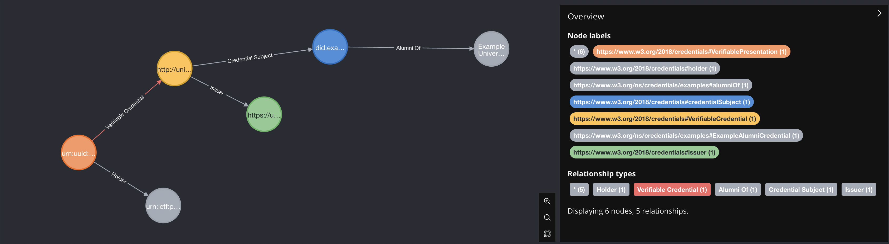
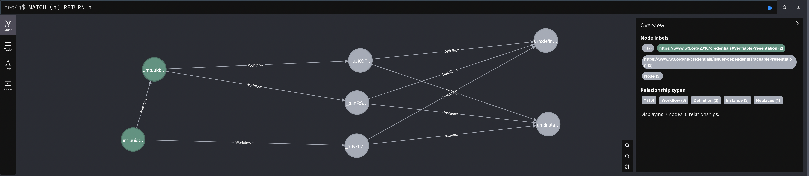

# Dry Run

Generate cypher without running it.

The unsafe flag is required to inline parameters.

Beware of cypher injection, use schemas to restrict the shape of the source data.

```sh
transmute graph \
--accept 'application/vnd.transmute.cypher' \
--input  'examples/vcdm/did.jsonld' \
--unsafe
```

# Importing JSON-LD

## Controller Documents

### application/did+ld+json

```sh
transmute graph \
--env '.env' \
--input  'examples/vcdm/did.jsonld'
```

### application/did+json

```sh
transmute graph \
--env '.env' \
--input  'examples/vcdm/did.json'
```

## Credentials

### application/vc+ld+json

```sh
transmute graph \
--env '.env' \
--input  'examples/vcdm/credential-with-location.json'
```

### application/vc+ld+jwt

```sh
transmute graph \
--env '.env' \
--input  'examples/vcdm/credential.jwt.flat.json'
```

## Presentations

### application/vp+ld+json

```sh
transmute graph \
--env '.env' \
--input  'examples/vcdm/presentation-with-location.json'
```

### application/vp+ld+jwt

```sh
transmute graph \
--env '.env' \
--input  'examples/vcdm/presentation.jwt.flat.json'
```

## Cypher Examples

### Get Holder Location

```
MATCH (holder:`https://www.w3.org/2018/credentials#holder`)-[:Location]->(place:`https://schema.org/Place`)
MATCH (place)-[:Geo]->(point:`https://schema.org/GeoCoordinates`)
RETURN holder, point
```

### Get Issuer Location

```
MATCH (issuer:`https://www.w3.org/2018/credentials#issuer`)-[:Location]->(place:`https://schema.org/Place`)
MATCH (place)-[:Geo]->(point:`https://schema.org/GeoCoordinates`)
RETURN issuer, point
```

### Get Distance Between Issuer and Holder

```
MATCH (issuer:`https://www.w3.org/2018/credentials#issuer`)-[:Location]->(p1:`https://schema.org/Place`)
MATCH (p1)-[:Geo]->(p2:`https://schema.org/GeoCoordinates`)
MATCH (holder:`https://www.w3.org/2018/credentials#holder`)-[:Location]->(p3:`https://schema.org/Place`)
MATCH (p3)-[:Geo]->(p4:`https://schema.org/GeoCoordinates`)
WITH
  point({longitude: toFloat(p2.`https://schema.org/longitude`), latitude: toFloat(p2.`https://schema.org/latitude`)}) AS issuerPoint,
  point({longitude: toFloat(p4.`https://schema.org/longitude`), latitude: toFloat(p4.`https://schema.org/latitude`)}) AS holderPoint
RETURN round(point.distance(issuerPoint, holderPoint)) AS presentationDistance
```

### Presentation

<!-- 
```sh
npm run transmute -- graph \
--env '.env' \
--input  'examples/neo4j/example-0.json'
```
-->

```sh
transmute graph \
--env '.env' \
--input  'examples/neo4j/example-0.json'
```



## Traceable Presentations

```sh
transmute graph \
--env '.env' \
--input  'examples/neo4j/simple-presentation-with-errors.json'

transmute graph \
--env '.env' \
--input  'examples/neo4j/simple-presentation-making-corrections.json'

```



