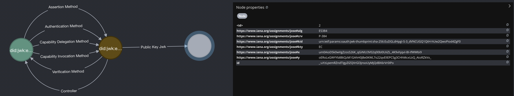

# Supply Chain Integrity, Transparency, and Trust (scitt)

- [datatracker](https://datatracker.ietf.org/wg/scitt/about/)


## Create Private Signing Key

```sh
transmute key generate \
--alg ES384 \
--output examples/scitt/private.signing.jwk.json
```


## Export Public Verification Key

```sh
transmute key export \
--input  examples/scitt/private.signing.jwk.json \
--output examples/scitt/public.verifying.jwk.json
```

<!--

npm run transmute -- graph \
--env '.env' \
--input  'examples/scitt/public.verifying.jwk.json'

-->



## Create Root Certificate

<!--

npm run transmute -- scitt certificate create \
--alg ES256 \
--issuer CN=Test CA \
--subject CN=Test CA \
--valid-from 2020/01/01 \
--valid-until 2020/01/03 \
--subject-guid f81d4fae-7dec-11d0-a765-00a0c91e6bf6 \
--subject-did did:web:root.transparency.example \
--subject-private-key examples/scitt/ca.cert.private.jwk.json \
--subject-certificate examples/scitt/ca.cert.public.pem

-->

```sh
transmute scitt certificate create \
--alg ES256 \
--valid-from 2020/01/01 \
--valid-until 2020/01/03 \
--issuer CN=Test CA \
--subject CN=Test CA \
--subject-guid f81d4fae-7dec-11d0-a765-00a0c91e6bf6 \
--subject-did did:web:root.transparency.example \
--subject-private-key examples/scitt/ca.cert.private.jwk.json \
--subject-certificate examples/scitt/ca.cert.public.pem
```

## Create Leaf Certificate

<!--

npm run transmute -- scitt certificate create \
--alg ES256 \
--valid-from 2020/01/01 \
--valid-until 2020/01/03 \
--issuer-private-key examples/scitt/ca.cert.private.jwk.json \
--issuer-certificate examples/scitt/ca.cert.public.pem \
--subject CN=Test CA \
--subject-did did:web:issuer.key.transparency.example \
--subject-private-key examples/scitt/user.private.jwk.json \
--subject-public-key examples/scitt/user.public.jwk.json \
--subject-certificate examples/scitt/user.cert.public.pem

-->

```sh
transmute scitt certificate create \
--alg ES256 \
--valid-from 2020/01/01 \
--valid-until 2020/01/03 \
--issuer-private-key examples/scitt/ca.cert.private.jwk.json \
--issuer-certificate examples/scitt/ca.cert.public.pem \
--subject CN=Test CA \
--subject-did did:web:issuer.key.transparency.example \
--subject-private-key examples/scitt/user.private.jwk.json \
--subject-public-key examples/scitt/user.public.jwk.json \
--subject-certificate examples/scitt/user.cert.public.pem
```

## Create Controller

<!--

npm run transmute -- scitt certificate controller \
--subject-did did:web:issuer.key.transparency.example \
--subject-public-key examples/scitt/user.public.jwk.json \
--controller examples/scitt/user.did.json

-->

```sh
transmute scitt certificate controller \
--subject-did did:web:issuer.key.transparency.example \
--subject-public-key examples/scitt/user.public.jwk.json \
--controller examples/scitt/user.did.json
```

## Statements

<!-- 
```sh
npm run build;

npm run transmute -- scitt statement issue \
--issuer-kid did:web:scitt.xyz#urn:ietf:params:oauth:jwk-thumbprint:sha-256:gP8lW7iRNl2u0oE99RtuAQ7hnpWQIfEF8f0n_tK_ch8 \
--issuer-key examples/scitt/private.signing.jwk.json \
--statement  examples/scitt/statement.jpg \
--signed-statement examples/scitt/statement.cose

npm run transmute -- scitt statement verify \
--did-resolver https://transmute.id/api \
--statement  examples/scitt/statement.jpg \
--signed-statement examples/scitt/statement.cose \
--output examples/scitt/statement.cose.verified.json

```
-->

### Issue 

```sh
transmute scitt statement issue \
--issuer-key examples/scitt/private.signing.jwk.json \
--issuer-kid did:web:scitt.xyz#urn:ietf:params:oauth:jwk-thumbprint:sha-256:gP8lW7iRNl2u0oE99RtuAQ7hnpWQIfEF8f0n_tK_ch8 \
--statement  examples/scitt/statement.jpg \
--signed-statement examples/scitt/statement.cose
```

### Verify

```sh
transmute scitt statement verify \
--statement  examples/scitt/statement.jpg \
--signed-statement examples/scitt/statement.cose \
```

## Receipts

<!-- 
```sh
npm run build;

npm run transmute -- scitt receipt attach \
--signed-statement  examples/scitt/statement.cose \
--receipt  examples/scitt/statement.inclusion.cose \
--transparent-statement examples/scitt/statement.transparent.cose

npm run transmute -- scitt receipt detach \
--signed-statement  examples/scitt/statement.cose \
--receipt  examples/scitt/statement.inclusion.cose \
--transparent-statement examples/scitt/statement.transparent.cose

npm run transmute -- scitt receipt issue \
--transparency-service https://scitt.xyz/api/did:web:scitt.xyz \
--statement  examples/scitt/statement.jpg \
--signed-statement  examples/scitt/statement.cose \
--transparent-statement examples/scitt/statement.transparent.cose

npm run transmute -- scitt receipt verify \
--statement  examples/scitt/statement.jpg \
--transparent-statement examples/scitt/statement.transparent.cose
```
-->

## Attach

```sh
transmute scitt receipt attach \
--receipt  examples/scitt/statement.inclusion.cose \
--signed-statement  examples/scitt/statement.cose  \
--transparent-statement examples/scitt/statement.transparent.cose
```

## Detach

```sh
transmute scitt receipt detach \
--receipt  examples/scitt/statement.inclusion.cose \
--signed-statement  examples/scitt/statement.cose  \
--transparent-statement examples/scitt/statement.transparent.cose
```

## Issue

Assumes the transparency service has a registration policy that accepts statements signed by specific issuers, and that the statement provided is signed by one of those issuers.

```sh
transmute scitt receipt issue \
--transparency-service https://scitt.xyz/api/did:web:scitt.xyz \
--statement  examples/scitt/statement.jpg \
--signed-statement  examples/scitt/statement.cose \
--transparent-statement examples/scitt/statement.transparent.cose
```

## Verify

Assumes the issuers of the signed statenment and the receipt are trusted by the client.

```sh
transmute scitt receipt verify \
--statement  examples/scitt/statement.jpg \
--transparent-statement examples/scitt/statement.transparent.cose
```